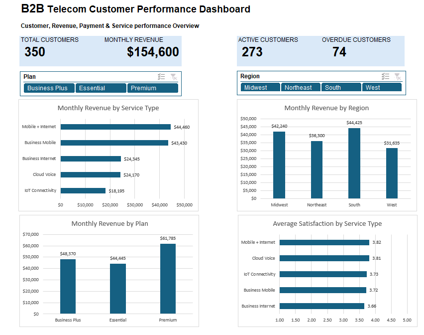

# B2B Telecom Customer Performance Analysis

## Project Overview

This project analyzes a fictional B2B telecommunications dataset using Microsoft Excel.

The goal is to explore customer, revenue, payment, service, and satisfaction data in order to identify useful business insights and present them through an interactive dashboard.

## Tools Used

- Microsoft Excel
- PivotTables
- PivotCharts
- Slicers
- Excel data cleaning and validation techniques

## Project Workflow

1. Understand the business problem and dataset
2. Clean and validate the raw data
3. Perform exploratory data analysis (EDA)
4. Build interactive PivotTables and charts
5. Create an Excel dashboard
6. Identify key business findings and recommendations
## Dashboard

## Key Findings

- The dataset contains 350 B2B customer accounts generating $154,600 in monthly revenue.
- 273 customers (78%) are active, while 77 customers (22%) are inactive.
- 74 customers (21.14%) have overdue payment status, representing $34,780 in monthly charges.
- Premium is the highest-revenue plan, generating $61,785 per month from 122 customers.
- Mobile + Internet generates the highest monthly revenue among service types at $44,460 and has the highest average satisfaction score at 3.82 out of 5.
- The South has the largest customer base with 104 customers and the highest regional monthly revenue at $44,425.
- The Midwest generates $42,240 in monthly revenue from 87 customers, approaching the South's revenue despite having fewer customers.

- ## Business Recommendations

- Prioritize review and follow-up of overdue accounts, particularly higher-value accounts, to improve payment visibility and reduce outstanding-payment risk.
- Analyze the factors driving Premium's higher revenue contribution and assess whether appropriate customers on lower-tier plans may benefit from higher-value service offerings.
- Review the Midwest customer mix to understand why the region generates revenue close to the South despite having fewer customers, and determine whether those characteristics can inform account strategy in other regions.
- Continue monitoring satisfaction alongside service revenue, with particular attention to lower-scoring services such as Business Internet to identify potential customer-experience improvement opportunities.

- ## Files

- `B2B_Telecom_Customer_Analysis.xlsx` - Complete Excel workbook containing the cleaned dataset, exploratory analysis, PivotTables, interactive dashboard, and project guide.
- `dashboard.png` - Preview of the completed interactive Excel dashboard.

## Note

This project uses a fictional B2B telecommunications dataset created for portfolio and skills-demonstration purposes.
